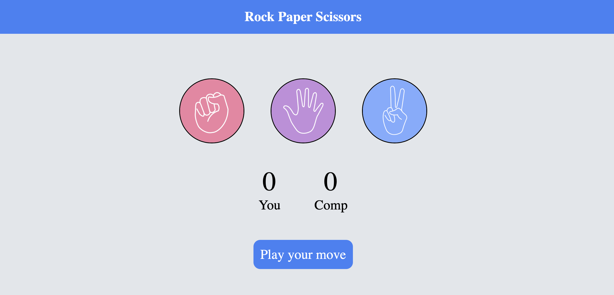

# Rock Paper Scissors Game

A clean, interactive, and responsive web-based Rock Paper Scissors game built using HTML, CSS, and JavaScript. Play against the computer, track your live scores, and try to win!

## Preview



## Features

*   **Interactive UI:** Clean, minimalist design featuring hand-gesture icons.
*   **Real-time Score Tracking:** Keeps score of both the player ("You") and the computer ("Comp") during the session.
*   **Dynamic Status Updates:** Displays the status of the current round or guides you to "Play your move".
*   **Smart Computer Logic:** Randomly generates computer choices to ensure a fair and unpredictable game.

## Tech Stack

*   **HTML5:** Structured layout for the game board and interactive elements.
*   **CSS3:** Styling, centering, typography, and hover-state interactions.
*   **JavaScript:** Game logic, DOM manipulation, event listeners, and score tracking.

## File Structure

```text
├── index.html          # Main HTML structure
├── style.css           # Styling and layout
├── app.js             # Game logic and score tracking
└── images/             # Folder containing game assets and screenshots
    ├── Preview.png     # Main repository screenshot
    ├── paper.png       # Paper gesture icon
    ├── rock.png        # Rock gesture icon
    └── scissors.png    # Scissors gesture icon
